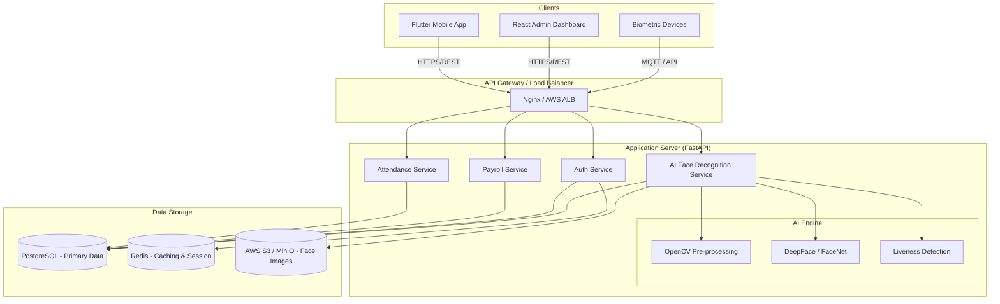

# System Architecture: Employee Attendance & Payroll System

## High-Level Architecture

The system follows a microservices-ready modular monolith architecture, ensuring scalability and security.

## Component Breakdown

1.  **Frontend Clients**
    *   **Flutter Mobile App**: Employee interface for face scan, geolocation check-in, and view payslips.
    *   **React Admin Panel**: HR and Admin interface for employee management, payroll processing, and reports.
    *   **Biometric Devices**: Hardware integration via SDKs pushing data to the endpoint.

2.  **Backend (FastAPI)**
    *   **Auth Service**: JWT-based authentication, Role-Based Access Control (RBAC).
    *   **AI Service**: Handles image processing, face embedding generation, and vector matching.
    *   **Attendance Service**: Core logic for present/absent marking, geofencing validation, and shift management.
    *   **Payroll Service**: Complex calculation engine for taxes, deductions, and net pay.

3.  **Infrastructure**
    *   **PostgreSQL**: Relational data (Employees, Attendance, Payroll).
    *   **Redis**: Caching hot data (configs, active sessions) and Celery task queues (if async processing is needed).
    *   **Object Storage**: Secure storage for face images (encrypted).

## Security & Compliance (DPDP Act 2023)
*   **Data Encryption**: AES-256 for database fields (especially biometric hash references). TLS 1.3 for transit.
*   **Consent Architecture**: Explicit consent recording before face registration.
*   **Audit Logs**: Immutable logs for all access to sensitive personnel data.
